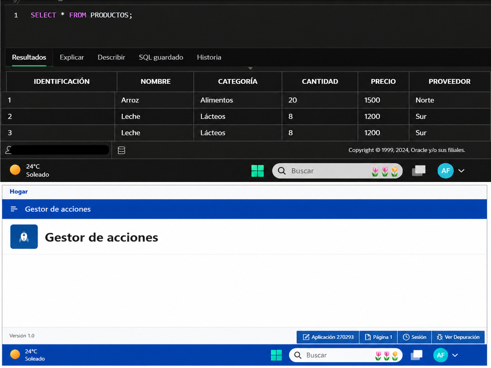

# Stock Manager - Oracle APEX

Proyecto de gestión de inventario desarrollado con **Oracle APEX** y **SQL**.

Este proyecto permite visualizar productos almacenados, su categoría, cantidad disponible, precio y proveedor.

---

## 🚀 Tecnologías utilizadas
- Oracle APEX
- SQL
- Git / GitHub
- Visual Studio Code

---

## 📦 Funcionalidades
- Gestión de stock
- Consulta de productos
- Base de datos SQL
- Visualización de inventario
- Gestión por categorías
- Control de cantidad y precio

---

## 🗃️ Base de datos
La tabla principal utilizada es:

`PRODUCTOS`

Campos:
- ID
- NOMBRE
- CATEGORIA
- CANTIDAD
- PRECIO
- PROVEEDOR

---

## 📸 Vista previa del proyecto


---

## 💻 Consulta SQL utilizada
```sql
SELECT * FROM PRODUCTOS;